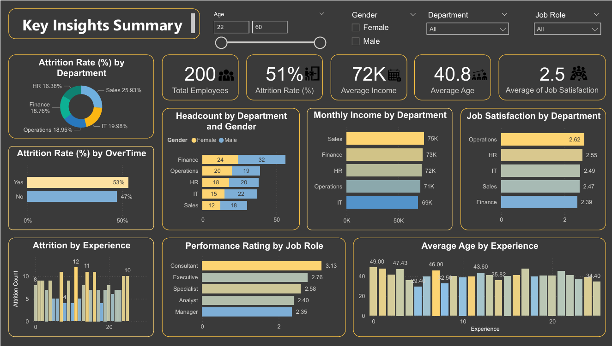

# Swetha's HR Analytics Portfolio

Welcome! I'm a Data Analyst with skills in:

- Excel 📊
- Power BI 📈
- SQL 🧮

# 👩‍💼 HR Analytics Dashboard

This project is an end-to-end HR analytics solution that explores employee data to gain insights into attrition, department-wise trends, gender-based pay gaps, and more. The project is built using **Excel**, **Power BI**, and **SQL**.

---

## 🛠️ Tools Used

- **Excel**: Data cleaning, pivot tables, and charting
- **Power BI**: Interactive dashboard and visualizations
- **SQL**: Data extraction and transformation

---

## 📊 Dashboard Preview

---

## 📁 Files Included

- `HR_Analytics.pbix`: Power BI visualization file  
- `HR_Analytics_Dashboard.png`: Dashboard screenshot preview  
- `HR_Analytics.xlsx`: Cleaned dataset used for analysis  
- `HR_Analytics.sql`: SQL queries for data extraction and transformation  

---

## 📌 Key Insights

- **Attrition Rate**: 51% overall, Organization losing half its workforce
- **Gender Pay Gap**: Males are paid more on average across departments
- **Job Satisfaction**: 2.5 overall, critically low employee engagement
- **Perfomance Rating**: Managers underperform (2.35) and create retention risk

---
## 💡 Solution

- **Reduce Attrition**: Conduct exit interviews, introduce career growth paths, and improve work-life balance to retain talent.
- **Close Gender Pay Gap:**: Perform salary audits, enforce transparent pay structures, and promote fair promotion practices.
- **Boost Job Satisfaction:**: Gather employee feedback, offer upskilling and recognition programs, and enhance workplace culture.
- **Improve Manager Performance**: Provide leadership training, set clear KPIs, and use feedback systems to strengthen management effectiveness.

---

## 💡 Learning Outcomes

- Built a full-stack data analytics project using real-world HR data
- Practiced EDA (Exploratory Data Analysis) and dashboard storytelling
- Improved SQL skills for querying structured datasets

---

## 🚀 How to View the Dashboard

- Open the `HR_Analytics_Dashboard.pbix` file in Power BI Desktop
- Open the Excel file to explore pivot tables and charts
- Open `.sql` file in any SQL IDE (like SSMS or DBeaver) to view the queries

---

## 📞 Contact

**Swetha K**  
📧 swethakogilaswaran@gmail.com  

---

